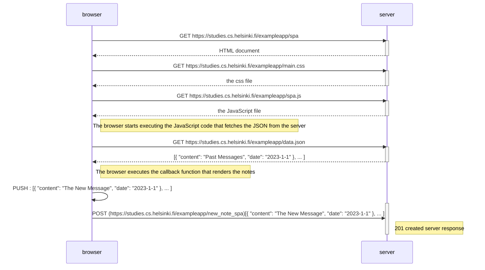

```mermaid
sequenceDiagram
    participant browser
    participant server

    browser->>server: GET https://studies.cs.helsinki.fi/exampleapp/spa
    activate server
    server-->>browser: HTML document
    deactivate server

    browser->>server: GET https://studies.cs.helsinki.fi/exampleapp/main.css
    activate server
    server-->>browser: the css file
    deactivate server

    browser->>server: GET https://studies.cs.helsinki.fi/exampleapp/spa.js
    activate server
    server-->>browser: the JavaScript file
    deactivate server

    Note right of browser: The browser starts executing the JavaScript code that fetches the JSON from the server

    browser->>server: GET https://studies.cs.helsinki.fi/exampleapp/data.json
    activate server
    server-->>browser: [{ "content": "Past Messages", "date": "2023-1-1" }, ... ]
    deactivate server

Note right of browser: The browser executes the callback function that renders the notes

    browser->>browser: PUSH : [{ "content": "The New Message", "date": "2023-1-1" }, ... ]
    activate server
    browser->>server: POST (https://studies.cs.helsinki.fi/exampleapp/new_note_spa)[{ "content": "The New Message", "date": "2023-1-1" }, ... ]
    Note right of server: 201 created server response
    deactivate server
```
